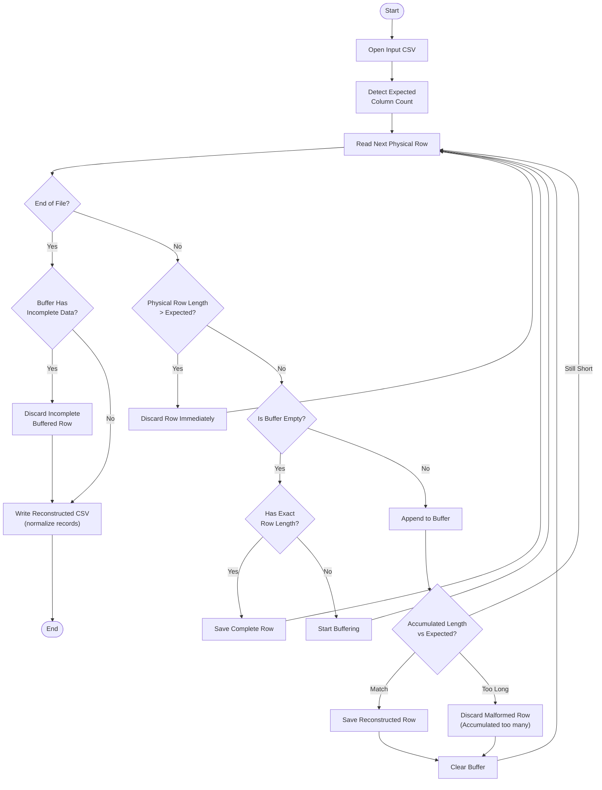

# Fixerr  
_A High-Performance Rust CLI & Library for Repairing Fragmented CSV Records_

[](https://www.rust-lang.org/)  [](https://opensource.org/licenses/MIT)

---

## Overview

**Fixerr** is a high-performance Rust command-line tool and library for repairing structurally broken CSV files, particularly those affected by unescaped newline characters.

The tool was originally created to solve a critical data integrity issue affecting **Georgian Revenue Service (rs.ge)** waybill and tax invoice CSV data exports, which often contain fields with user-entered line breaks (e.g., organization names, product descriptions and addresses) that are not properly escaped. Such malformed records often cannot be imported directly into data warehouses, accounting systems, ERPs, or MS Excel without issues. Fixerr provides a fast, reliable, and automated solution to tackle this problem.

---

## The Problem

Malformed CSV files typically exhibit fragmentation patterns like those below:  

| Case | Error Type | Description | Example * |
|------|------------|-------------|---------|
| **1** | Trailing Split | Newline at the end of a field pushes the next value to a new line. | `9413154,Tbilisi Waters,Georgian Product` ↩︎ `,1722.63` |
| **2** | Mid-Value Split | A field breaks mid-sentence. | `9413155,Bodorna Waters,Mineral water from` ↩︎ `Bodorna` |
| **3** | Cascading Split | Multiple fields are broken. | `9413156,Gori` ↩︎ `Beverages`,`Product from` ↩︎ `Gori,3427.50` |
| **4** | Multi-Row Split | One logical field spans 3 or more physical rows. | `9413157,Sairme Waters,This` ↩︎ `Product` ↩︎ `Is from` ↩︎ `Sarime,1736.10` |
| **5** | Quoted Split | Multiline quoted field breaks standard parsers. | `9413158,Svaneti Waters,"Mestia,` ↩︎ `Georgia",2505.25` |

**ID, Organization, Details, Amount*

---

## Features (v0.1.0)

- **Simple Interface:** Menu-driven CLI with no complex commands.
- **Smart Detection:** Auto-detects column counts based on headers.
- **Record Repair:** Reconstructs records split across multiple lines.
- **Data Cleaning:** Trims whitespace and removes accidental newlines.
- **Flexible Formats:** Supports Comma, Semicolon, Tab, and Pipe delimiters.
- **Configurable:** Easily adjust file paths and processing rules.
- **Transparent:** Displays detailed execution stats and timing.

The engine validates column structure to ensure accurate repairs, even on heavily corrupted files.

---

## Installation

### Prerequisites

- **Rust 1.62 or higher**  
Install Rust: https://rustup.rs/

Check your version:
```bash
rustc --version
```

### Build from Source

```bash
git clone https://github.com/nicholas-gurgenidze/fixerr.git
cd fixerr

cargo build --release
# Binary will be at: target/release/fixerr
```

## Logic Flow
Fixerr reconstructs CSV rows by buffering split lines until they form a complete row with the expected number of columns. Any row that contains more columns than expected is marked as malformed and discarded.



## Architecture & Usage

This project is structured as a **dual-target Rust crate**:

### 1. CLI Tool (for End Users)
The `main.rs` binary provides an interactive terminal interface for repairing files.

```bash
cargo run --release
```

### 2. Library (for Developers)
The `lib.rs` library exposes the core reconstruction engine, allowing other Rust programs to utilize the repair logic without the CLI overhead.

```bash
use fixerr::reconstruct_records;
```
## Configuration

### Default Settings

```toml
delimiter   = ","
header_mode = "HasHeaders"
input_file  = "data.csv"
output_file = "output.csv"
```

### Header Mode & Column Detection

* **`HasHeaders` (Default):**
  This is the standard format for **rs.ge** exports. In this mode, the program automatically detects the expected column count by reading the first row of the file.

* **`NoHeaders`:**
  If your data lacks a header row, the program cannot automatically determine the correct structure. If you select this mode, **the program will pause and prompt you to manually enter the expected number of columns** before processing begins.

### Supported Delimiters

* **`Comma` (`,`) (Default):**
  This is the standard format for **rs.ge** exports and the most common type of files. 
* **`Semicolon` (`;`):**
  Common in European CSV files. 
* **`Tab` (`\t`):**
  Tab-Separated (TSV) files.
* **`Pipe` (`|`):**
  Less common type of files.

## Testing

```bash
# Run all tests
cargo test

# Run specific test
cargo test test_case_3_multi_column_cascading_split
```

## Documentation

This project uses idiomatic Rust documentation comments. To generate and view the full API documentation locally:

```bash
cargo doc --open --no-deps
```

## Roadmap
### Upcoming Enhancements
- Fully streamed pipeline (Read → Fix → Write)
- Integration of BufWriter for reduced syscall overhead
- Parallel CSV batch processing using Rayon
- Error logging to a dedicated log file (e.g. list of unfixable rows)  
- Configurable ability to skip unfixable rows instead of removing them  
- Automatic delimiter detection (comma, semicolon, tab, pipe) based on row sampling

### Long-Term Vision
- WebAssembly build enabling fully client-side CSV repair
- Drag-and-drop browser UI using React
- Zero-knowledge data handling: all parsing done locally in-browser

## License
This project is licensed under **MIT License**. see the `LICENSE.md` file for full details.

## Author
### Nicholas Gurgenidze   
Email: [nicholas.gurgenidze@gmail.com](mailto:nicholas.gurgenidze@gmail.com)  
GitHub: [Link](https://github.com/nicholas-gurgenidze)  
LinkedIn: [Link](https://www.linkedin.com/in/nikolozi-gurgenidze)

## Development Note
Core logic, algorithms, and architecture were fully designed and implemented by **Nicholas Gurgenidze**.

AI assistance was used mostly for non-functional improvements, including:

- Display parts of UI boilerplate 
- README drafting and formatting   
- Regular and documentation comments    
- Minor safe refactorings

## Acknowledgments

- Built with the excellent [`csv`](https://crates.io/crates/csv) crate by **Andrew Gallant** (BurntSushi)
- Inspired by real-world data quality challenges in **Georgian Revenue Service** systems
- Thanks to the **Rust community** for outstanding documentation and tools
